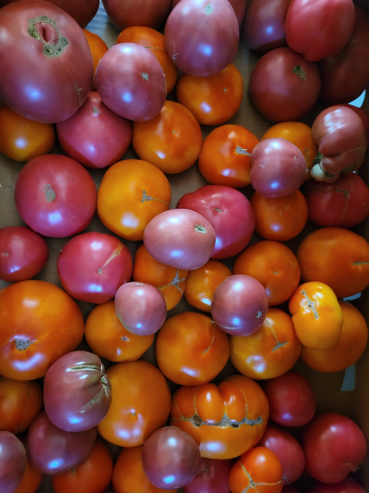
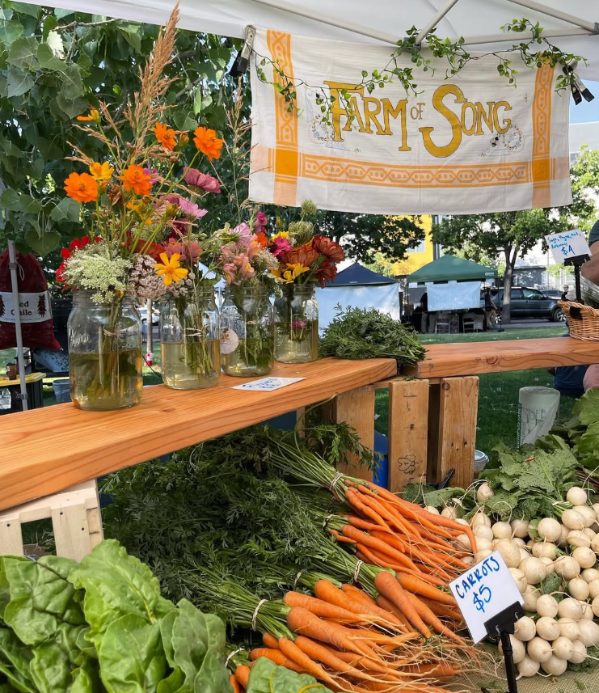
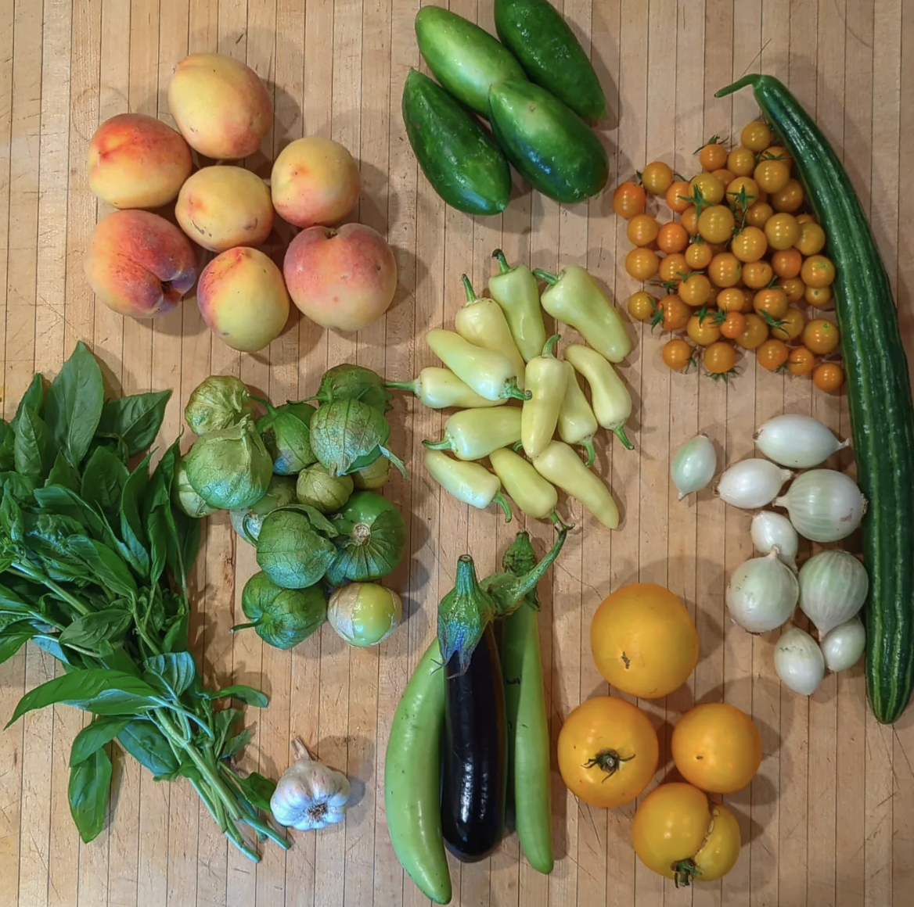

<section class="home-intro">
  
An oral history project rooted in food systems, community knowledge, and place.

  
Our local food system relies on farmers with localized knowledge of the unique cultural heritage and ecological challenges of the state. This knowledge is often shared through storytelling that highlights personal experiences and histories. This project – a community-engaged teaching, learning, and research exploration – collects oral histories of farming along the Middle Rio Grande to support resilience among farmers and our local food system. We support peer-to-peer knowledge sharing, educate students about local challenges and strengths, and celebrate the people who grow our food and tend the soil. Please reach out if you would like to get involved in this project – we seek farmers who would like to contribute their stories to our archives, students who would like to participate in collecting these stories and generating community-facing materials, and community partners who would like to learn more about how their food is grown and by whom..

</section>

<section class="home-image-band" aria-label="Featured paths into the project">
  <a href="farmer-profiles" class="home-image-link">
    
    Meet the farmers
  </a>
  <a href="oral-histories" class="home-image-link">
    
    Browse oral histories
  </a>
  <a href="{{ site.baseurl }}about" class="home-image-link">
    
    About the project
  </a>
</section>
